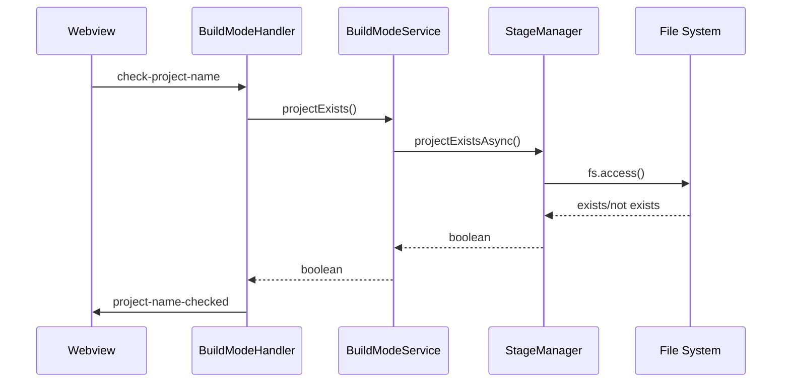
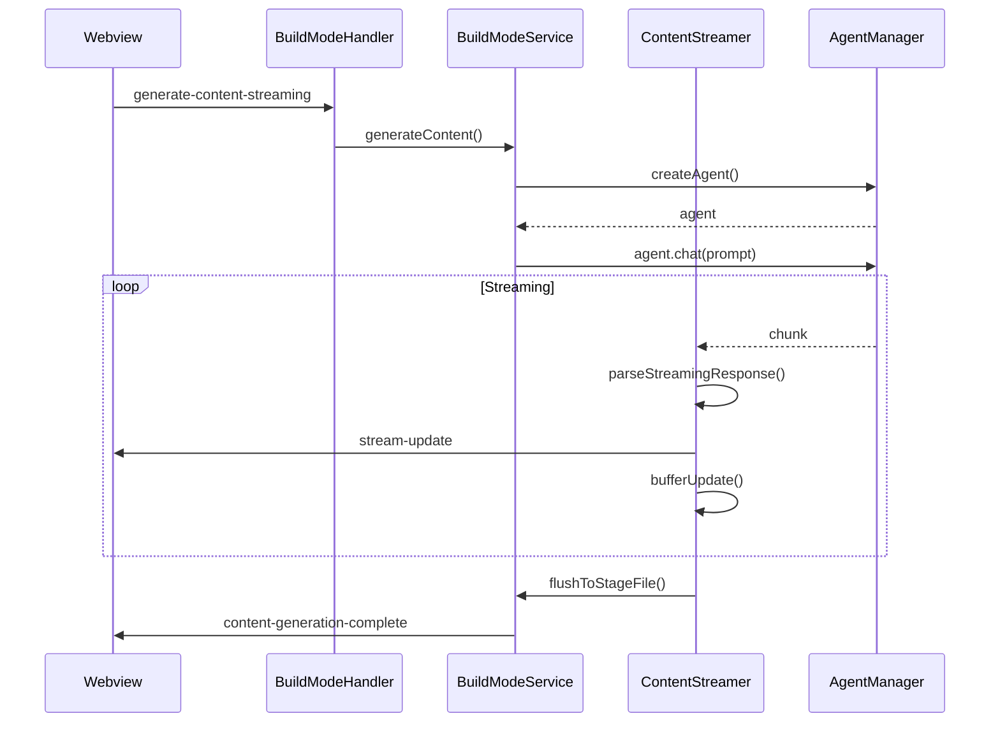
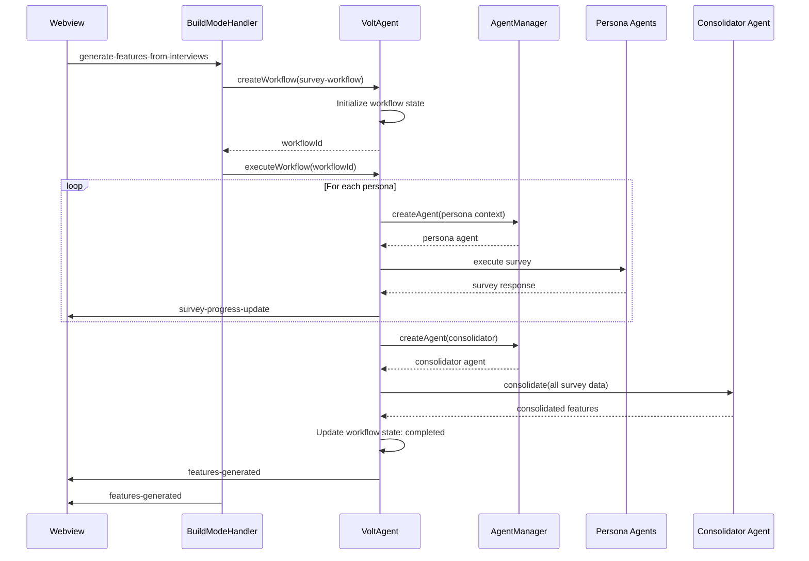
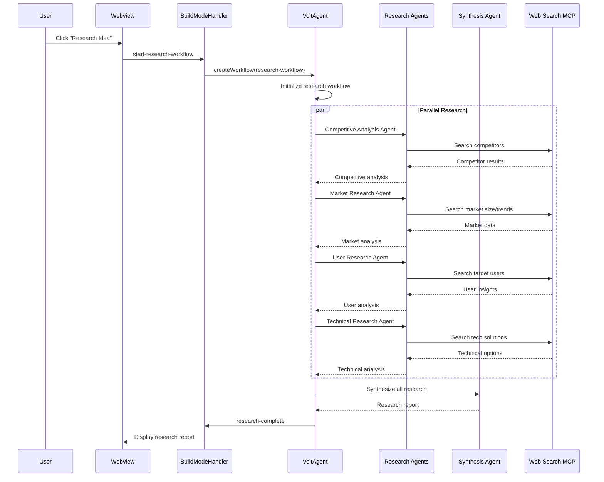
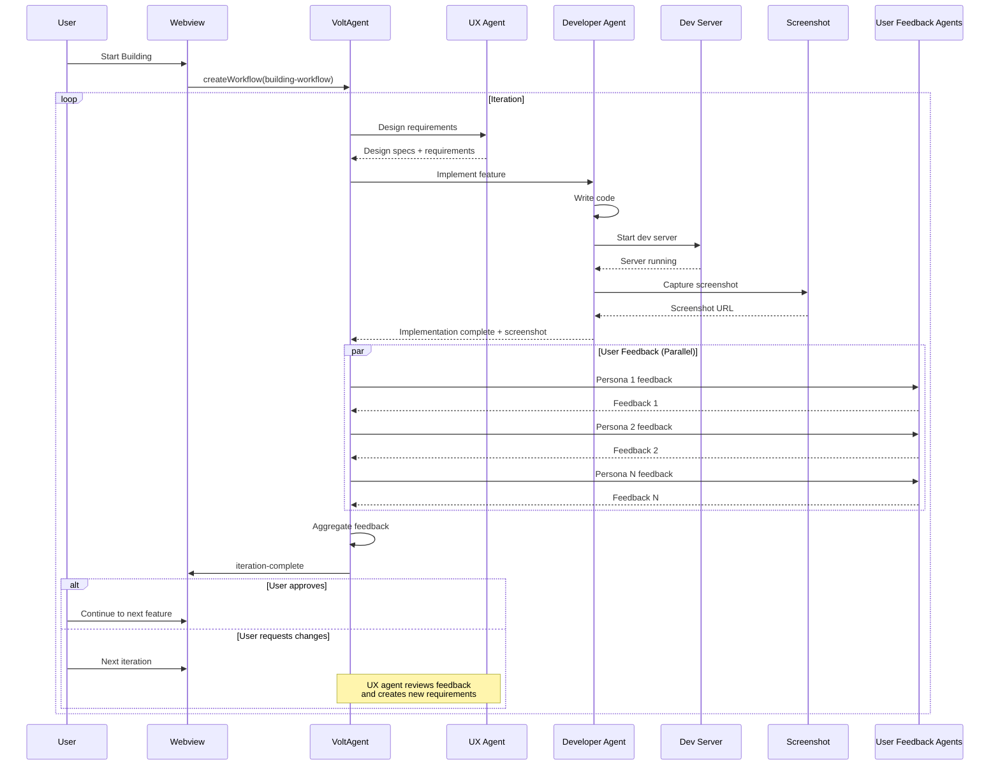
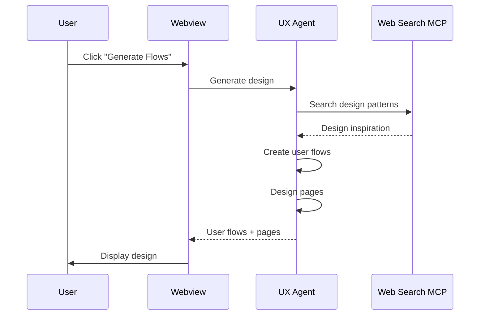
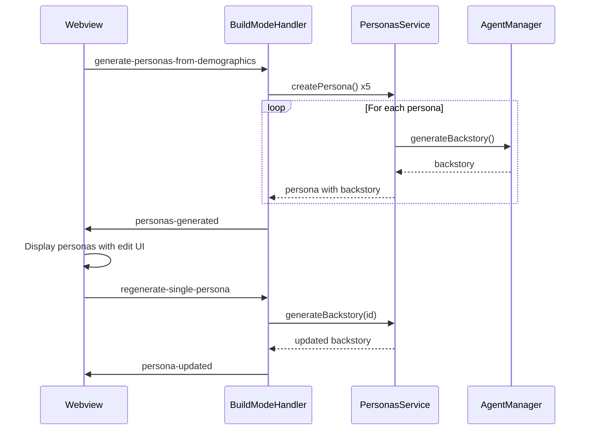

# Design Document: Build Mode Fixes

## Overview

This design addresses critical communication bugs in the Build Mode feature where message type mismatches between the backend handlers and webview frontend prevent proper project name validation, state restoration, and data persistence. The fix involves aligning message types and restructuring the file storage to use a more organized folder hierarchy.

## Architecture

The Build Mode feature follows a message-passing architecture between:

1. **Webview (Frontend)**: React-based UI in `src/webview/App.tsx` that sends messages via `vscode.postMessage()` and listens for responses via `window.addEventListener('message', ...)`

2. **BuildModeHandler (Backend)**: TypeScript handler in `src/features/build-mode/handlers/BuildModeHandler.ts` that processes webview messages and sends responses via `webview.postMessage()`

3. **BuildModeService**: Business logic layer that coordinates with StageManager, BuildLogManager, and ContentStreamer

4. **StageManager**: File system operations for reading/writing stage files and build state



## Components and Interfaces

### Message Type Alignment

The following message types need to be aligned in `src/webview/App.tsx`:

| Request Type | Handler Response | Webview Listener (Current) | Webview Listener (Fixed) |
|-------------|------------------|---------------------------|-------------------------|
| `check-project-name` | `project-name-checked` | `project-name-check` | `project-name-checked` |
| `get-build-state` | `build-state` | `build-state-loaded` | `build-state` |
| `load-build-log` | `build-log` | `build-log-loaded` | `build-log` |

### Stage Naming Convention

The stages follow a consistent naming convention defined in `STAGE_ORDER`:
- `idea` - Project idea and title
- `users` - User personas and demographics
- `features` - Feature definitions
- `team` - Team member roles
- `stories` - User stories
- `design` - Design specifications
- `building` - Active development iteration

### File Structure Changes

Current structure:
```
.personaut/
  {project-name}/
    build-state.json
    {project-name}.json (idea stage - inconsistent naming)
    {stage}.stage.json (other stages)
```

New structure:
```
.personaut/
  {project-name}/
    build-state.json
    planning/
      idea.json
      users.json
      features.json
      team.json
      stories.json
      design.json
    iterations/
      {iteration-number}/
        feedback.json
        consolidated-feedback.md
        {page-name}.png
```

### Migration Strategy

For backward compatibility:
1. When reading stage files, check both old and new locations
2. When writing stage files, always use new location
3. Update `build-state.json` paths to reflect new locations

### StageManager Interface Changes

```typescript
class StageManager {
  // Updated path methods - now uses planning/ subdirectory
  getStageFilePath(projectName: string, stage: string): string {
    // Returns: .personaut/{projectName}/planning/{stage}.json
    return path.join(this.baseDir, projectName, 'planning', `${stage}.json`);
  }
  
  getPlanningDir(projectName: string): string {
    return path.join(this.baseDir, projectName, 'planning');
  }
  
  getIterationDir(projectName: string, iterationNumber: number): string {
    return path.join(this.baseDir, projectName, 'iterations', String(iterationNumber));
  }
  
  getFeedbackPath(projectName: string, iterationNumber: number): string {
    return path.join(this.getIterationDir(projectName, iterationNumber), 'feedback.json');
  }
  
  getConsolidatedFeedbackPath(projectName: string, iterationNumber: number): string {
    return path.join(this.getIterationDir(projectName, iterationNumber), 'consolidated-feedback.md');
  }
  
  getScreenshotPath(projectName: string, iterationNumber: number, pageName: string): string {
    // Sanitize pageName to be filesystem-safe
    const safeName = pageName.toLowerCase().replace(/[^a-z0-9-_]/g, '-');
    return path.join(this.getIterationDir(projectName, iterationNumber), `${safeName}.png`);
  }
  
  // Updated initialization - creates planning/ directory
  async initializeProject(projectName: string, projectTitle?: string): Promise<void>;
  
  // Existing methods (unchanged signatures)
  writeStageFile(projectName: string, stage: string, data: any, completed: boolean): Promise<WriteResult>;
  readStageFile(projectName: string, stage: string): Promise<StageFile | null>;
  
  // New iteration methods
  async saveIterationFeedback(projectName: string, iterationNumber: number, feedback: UserFeedback[]): Promise<void>;
  async saveConsolidatedFeedback(projectName: string, iterationNumber: number, content: string): Promise<void>;
  async saveScreenshot(projectName: string, iterationNumber: number, pageName: string, data: Buffer): Promise<void>;
  async loadIterationData(projectName: string, iterationNumber: number): Promise<IterationData | null>;
}
```

### Webview Message Handler Changes

In `src/webview/App.tsx`, the message handler needs to be updated:

```typescript
// BEFORE (incorrect)
} else if (message.type === 'project-name-check') {
  // Handle project name validation response

// AFTER (correct - matches handler response)
} else if (message.type === 'project-name-checked') {
  // Handle project name validation response

// BEFORE (incorrect)
} else if (message.type === 'build-state-loaded') {
  // Handle build state loaded message

// AFTER (correct - matches handler response)
} else if (message.type === 'build-state') {
  // Handle build state message

// BEFORE (incorrect)
} else if (message.type === 'build-log-loaded') {
  // Handle build log loaded message

// AFTER (correct - matches handler response)
} else if (message.type === 'build-log') {
  // Handle build log message
```

## Data Models

### BuildState (unchanged)
```typescript
interface BuildState {
  projectName: string;
  projectTitle?: string;
  createdAt: number;
  lastUpdated: number;
  stages: {
    [key: string]: {
      completed: boolean;
      path: string;
      updatedAt: number;
      error?: string;
    };
  };
}
```

### IterationData (new)
```typescript
interface IterationData {
  iterationNumber: number;
  feedback: UserFeedback[];
  consolidatedFeedback?: string;
  screenshots: { pageName: string; path: string }[];
  createdAt: number;
  lastUpdated: number;
}

interface UserFeedback {
  personaName: string;
  rating: number;
  feedback: string;
  timestamp: number;
}
```

## AI Content Generation

### Architecture

The content generation system integrates with AgentManager to generate content for build stages:



### Content Generation Implementation

The `handleGenerateContent` method needs to:
1. Create an agent using AgentManager
2. Send the prompt to the agent
3. Stream responses through ContentStreamer
4. Parse and buffer updates
5. Flush to stage files periodically
6. Handle errors and partial content

```typescript
private async handleGenerateContent(message: WebviewMessage, webview: any): Promise<void> {
  // Validate inputs
  // Create agent with appropriate system prompt
  // Stream content generation
  // Use ContentStreamer to parse and buffer updates
  // Send updates to webview
  // Handle completion or errors
}
```

## VoltAgent - Agent Coordination System

### Overview

VoltAgent (https://voltagent.dev/) is an open-source agent coordination framework that orchestrates multi-agent workflows. It provides:
- Declarative workflow definitions
- Agent lifecycle management
- State persistence and resumption
- Inter-agent communication
- Progress tracking and observability
- Error handling and recovery
- Tool/MCP integration

### VoltAgent Integration

VoltAgent will be integrated as a dependency to handle complex multi-agent workflows in the build process. Key features we'll use:

1. **Workflow Definition**: Define survey and consolidation workflows declaratively
2. **Agent Orchestration**: Coordinate multiple persona agents and consolidator agents
3. **State Management**: Track workflow progress and allow pause/resume
4. **Tool Integration**: Connect agents to MCP servers (like Web Search)
5. **Observability**: Monitor agent interactions and workflow progress

### VoltAgent Workflow Structure

```typescript
// Example workflow for feature generation
const featureSurveyWorkflow = {
  name: 'feature-survey',
  agents: [
    {
      id: 'persona-1',
      role: 'persona',
      systemPrompt: 'You are {persona.name}. {persona.backstory}',
      tools: ['web-search']
    },
    // ... more persona agents
    {
      id: 'consolidator',
      role: 'consolidator',
      systemPrompt: 'Analyze survey responses and generate consolidated features',
      tools: ['web-search']
    }
  ],
  steps: [
    {
      type: 'parallel',
      agents: ['persona-1', 'persona-2', ...],
      task: 'Survey personas about desired features'
    },
    {
      type: 'sequential',
      agent: 'consolidator',
      task: 'Consolidate survey responses',
      dependencies: ['persona-1', 'persona-2', ...]
    }
  ]
};
```

## Feature Generation from User Interviews

### Architecture

The feature generation system uses VoltAgent to coordinate persona surveys and consolidation:



### Feature Survey Flow with VoltAgent

1. **Workflow Creation**: VoltAgent creates a survey workflow with steps:
   - Step 1-N: Create and survey each persona agent
   - Step N+1: Consolidate all survey responses
   - Step N+2: Save results to stage file

2. **Persona Agent Creation**: For each generated persona, VoltAgent:
   - Creates an AI agent with that persona's context (backstory, attributes)
   - Tracks agent creation in workflow state

3. **Survey Execution**: VoltAgent orchestrates asking each persona agent:
   - "What features would you want in this product?"
   - "How would you rate the idea (1-10) if it had feature X?"
   - "How would you rate the idea (1-10) if it didn't have feature X?"
   - "How often would you use feature X?" (Daily, Weekly, Monthly, Rarely)

4. **Survey Data Collection**: VoltAgent collects all responses with persona attribution and stores in workflow context

5. **Consolidation**: VoltAgent invokes consolidator agent with all survey data to:
   - Identify common feature themes
   - Calculate average ratings and priority
   - Determine frequency patterns
   - Generate feature descriptions
   - Assign personas to each feature

6. **Workflow State Management**: VoltAgent tracks:
   - Current step in workflow
   - Completed surveys
   - Partial results
   - Allows pause/resume if interrupted

7. **Display**: Show features with editable fields and survey metadata

8. **Individual Regeneration**: User can regenerate any single feature

9. **Persistence**: Save features with full survey data

### Data Models

```typescript
interface PersonaSurveyResponse {
  personaId: string;
  personaName: string;
  suggestedFeatures: string[];
  featureRatings: {
    feature: string;
    ratingWith: number;    // 1-10
    ratingWithout: number; // 1-10
    frequency: 'Daily' | 'Weekly' | 'Monthly' | 'Rarely';
    reasoning: string;
  }[];
}

interface ConsolidatedFeature {
  id: string;
  name: string;
  description: string;
  score: number;           // Average rating impact
  frequency: string;       // Most common frequency
  priority: 'Must-Have' | 'Should-Have' | 'Nice-to-Have';
  personas: string[];      // Persona IDs who want this
  surveyData: {
    personaResponses: PersonaSurveyResponse[];
    consolidationReasoning: string;
  };
}
```

### BuildModeHandler New Methods

```typescript
// Generate features from persona interviews
async generateFeaturesFromInterviews(
  projectName: string,
  personas: Persona[],
  ideaDescription: string,
  webview: vscode.Webview
): Promise<void>

// Regenerate single feature
async regenerateSingleFeature(
  featureId: string,
  surveyData: PersonaSurveyResponse[],
  webview: vscode.Webview
): Promise<void>
```

## Web Search MCP Server

### Overview

The Web Search MCP server provides agents with the ability to search the web for information. This enables:
- Competitive product research
- Market validation
- Feature inspiration
- Technical research
- Trend analysis

### MCP Server Configuration

```json
{
  "mcpServers": {
    "web-search": {
      "command": "npx",
      "args": ["-y", "@modelcontextprotocol/server-brave-search"],
      "env": {
        "BRAVE_API_KEY": "${BRAVE_API_KEY}"
      }
    }
  }
}
```

### Web Search Tools

The Web Search MCP provides the following tools:

1. **brave_web_search**: Search the web and return relevant results
   - Input: `query` (string), `count` (number, optional)
   - Output: Array of search results with title, URL, snippet, score

2. **brave_local_search**: Search for local businesses/places
   - Input: `query` (string), `count` (number, optional)
   - Output: Array of local results with name, address, rating

### Integration with VoltAgent

Agents in VoltAgent workflows can access web search by declaring it in their tools:

```typescript
{
  id: 'research-agent',
  role: 'researcher',
  systemPrompt: 'Research competitive products and market trends',
  tools: ['web-search']  // Grants access to Web Search MCP
}
```

### Search Result Format

```typescript
interface SearchResult {
  title: string;
  url: string;
  snippet: string;
  score: number;
  publishedDate?: string;
}

interface SearchResponse {
  query: string;
  results: SearchResult[];
  timestamp: number;
}
```

### Usage in Build Workflows

Web search can be used in various build stages:

1. **Idea Stage**: Research similar products and market trends
2. **Users Stage**: Research target demographics and user behaviors
3. **Features Stage**: Find competitive features and best practices
4. **Design Stage**: Research design patterns and UI trends

### Search Logging and Transparency

All web searches performed by agents will be logged:
- Query text
- Timestamp
- Results returned
- Agent that performed the search

This provides transparency and allows users to see what research informed the generated content.

## Research Workflow with VoltAgent

### Overview

The research workflow uses VoltAgent to coordinate multiple specialized research agents that gather and synthesize information about the project idea.

### Research Workflow Architecture



### Research Agents

VoltAgent coordinates four specialized research agents:

#### 1. Competitive Analysis Agent
**Role**: Identify and analyze competing products
**Tools**: web-search
**Tasks**:
- Search for similar products/services
- Analyze competitor features
- Identify market positioning
- Note pricing models
- Assess strengths and weaknesses

**System Prompt**:
```
You are a competitive analysis researcher. Your goal is to find and analyze products 
similar to: {idea}

Search for:
1. Direct competitors (same solution)
2. Indirect competitors (alternative solutions)
3. Market leaders in this space

For each competitor, document:
- Product name and URL
- Key features
- Target market
- Pricing model
- Unique value proposition
- Strengths and weaknesses
```

#### 2. Market Research Agent
**Role**: Validate market opportunity and trends
**Tools**: web-search
**Tasks**:
- Research market size and growth
- Identify market trends
- Find industry reports
- Assess market maturity
- Identify opportunities and threats

**System Prompt**:
```
You are a market research analyst. Research the market opportunity for: {idea}

Search for:
1. Market size and growth projections
2. Industry trends and forecasts
3. Market segments and niches
4. Regulatory considerations
5. Market maturity and saturation

Provide data-driven insights with sources.
```

#### 3. User Research Agent
**Role**: Research target users and their needs
**Tools**: web-search
**Tasks**:
- Identify target user demographics
- Research user pain points
- Find user behavior patterns
- Discover user preferences
- Identify user communities

**System Prompt**:
```
You are a user researcher. Research potential users for: {idea}

Search for:
1. Target user demographics
2. Common pain points and frustrations
3. Current solutions users are using
4. User communities and forums
5. User preferences and behaviors

Focus on understanding who would use this and why.
```

#### 4. Technical Research Agent
**Role**: Research technical approaches and solutions
**Tools**: web-search
**Tasks**:
- Research technical architectures
- Find relevant technologies
- Identify best practices
- Discover technical challenges
- Find open-source solutions

**System Prompt**:
```
You are a technical researcher. Research technical approaches for: {idea}

Search for:
1. Relevant technologies and frameworks
2. Technical architectures and patterns
3. Open-source projects and libraries
4. Technical challenges and solutions
5. Best practices and standards

Focus on technical feasibility and implementation approaches.
```

### Synthesis Agent

After all research agents complete, the synthesis agent consolidates findings:

**Role**: Synthesize all research into a cohesive report
**Tools**: None (works with collected data)
**Tasks**:
- Consolidate findings from all research agents
- Identify key insights and patterns
- Generate recommendations
- Create structured research report
- Highlight opportunities and risks

**System Prompt**:
```
You are a research synthesis expert. Consolidate the following research findings 
into a comprehensive report for: {idea}

Research Data:
- Competitive Analysis: {competitiveAnalysis}
- Market Research: {marketResearch}
- User Research: {userResearch}
- Technical Research: {technicalResearch}

Create a structured report with:
1. Executive Summary
2. Competitive Landscape
3. Market Opportunity
4. Target Users
5. Technical Feasibility
6. Key Recommendations
7. Risks and Challenges

Include all sources and links for verification.
```

### Research Report Format

```typescript
interface ResearchReport {
  id: string;
  projectName: string;
  idea: string;
  timestamp: number;
  sections: {
    executiveSummary: string;
    competitiveLandscape: {
      competitors: Array<{
        name: string;
        url: string;
        features: string[];
        strengths: string[];
        weaknesses: string[];
      }>;
      analysis: string;
    };
    marketOpportunity: {
      marketSize: string;
      trends: string[];
      opportunities: string[];
      threats: string[];
      analysis: string;
    };
    targetUsers: {
      demographics: string[];
      painPoints: string[];
      behaviors: string[];
      communities: string[];
      analysis: string;
    };
    technicalFeasibility: {
      technologies: string[];
      architectures: string[];
      challenges: string[];
      solutions: string[];
      analysis: string;
    };
    recommendations: string[];
    risks: string[];
  };
  sources: Array<{
    agent: string;
    query: string;
    url: string;
    title: string;
    snippet: string;
    timestamp: number;
  }>;
}
```

### VoltAgent Workflow Configuration

```typescript
const researchWorkflow = {
  name: 'idea-research',
  agents: [
    {
      id: 'competitive-analyst',
      role: 'competitive-analysis',
      systemPrompt: competitiveAnalysisPrompt,
      tools: ['web-search']
    },
    {
      id: 'market-researcher',
      role: 'market-research',
      systemPrompt: marketResearchPrompt,
      tools: ['web-search']
    },
    {
      id: 'user-researcher',
      role: 'user-research',
      systemPrompt: userResearchPrompt,
      tools: ['web-search']
    },
    {
      id: 'tech-researcher',
      role: 'technical-research',
      systemPrompt: technicalResearchPrompt,
      tools: ['web-search']
    },
    {
      id: 'synthesizer',
      role: 'synthesis',
      systemPrompt: synthesisPrompt,
      tools: []
    }
  ],
  steps: [
    {
      type: 'parallel',
      agents: ['competitive-analyst', 'market-researcher', 'user-researcher', 'tech-researcher'],
      task: 'Conduct research',
      timeout: 120000 // 2 minutes per agent
    },
    {
      type: 'sequential',
      agent: 'synthesizer',
      task: 'Synthesize findings',
      dependencies: ['competitive-analyst', 'market-researcher', 'user-researcher', 'tech-researcher']
    }
  ],
  onProgress: (update) => {
    // Send progress updates to webview
    webview.postMessage({
      type: 'research-progress',
      agent: update.agent,
      status: update.status,
      progress: update.progress
    });
  }
};
```

### Research File Storage

Research reports are saved to:
```
.personaut/{project-name}/research/
  research-{timestamp}.json     # Full research report
  sources.json                  # All web sources with metadata
```

### UI Display

The research report is displayed in the webview with:
- Collapsible sections for each research area
- Inline source citations with links
- Ability to regenerate specific sections
- Export to markdown option
- Visual indicators for high-confidence vs low-confidence findings

## Building Workflow with VoltAgent

### Overview

The building stage uses VoltAgent to coordinate a standardized team workflow: UX → Developer → User Feedback. This creates an iterative development cycle where features are designed, implemented, and validated.

### Building Workflow Architecture



### Standard Team Configuration

The team is **fixed** and **non-editable**:
- **UX Agent**: Designs features and writes requirements
- **Developer Agent**: Implements features and captures screenshots
- **User Feedback Agents**: One per persona, provides feedback in parallel

The UI should **not** allow adding/removing team members. This standardization ensures consistent workflow execution.

### VoltAgent Building Workflow

```typescript
const buildingWorkflow = {
  name: 'building-iteration',
  agents: [
    {
      id: 'ux-agent',
      role: 'ux-designer',
      systemPrompt: uxAgentPrompt,
      tools: ['web-search']
    },
    {
      id: 'developer-agent',
      role: 'developer',
      systemPrompt: developerAgentPrompt,
      tools: ['file-write', 'file-read', 'execute-command', 'web-search']
    },
    ...personas.map((persona, idx) => ({
      id: `feedback-agent-${idx}`,
      role: 'user-feedback',
      systemPrompt: createPersonaFeedbackPrompt(persona),
      tools: []
    }))
  ],
  steps: [
    {
      type: 'sequential',
      agent: 'ux-agent',
      task: 'Create design requirements',
      input: {
        userStories: context.userStories,
        previousFeedback: context.previousFeedback || null,
        currentIteration: context.iterationNumber
      }
    },
    {
      type: 'sequential',
      agent: 'developer-agent',
      task: 'Implement feature',
      dependencies: ['ux-agent'],
      input: {
        designRequirements: '${ux-agent.output}',
        framework: context.framework,
        existingCode: context.existingCode
      },
      postExecution: async (result) => {
        // Start dev server
        const serverUrl = await startDevServer(context.projectName);
        // Capture screenshot
        const screenshot = await captureScreenshot(serverUrl);
        return { ...result, serverUrl, screenshot };
      }
    },
    {
      type: 'parallel',
      agents: personas.map((_, idx) => `feedback-agent-${idx}`),
      task: 'Provide user feedback',
      dependencies: ['developer-agent'],
      input: {
        screenshot: '${developer-agent.screenshot}',
        designRequirements: '${ux-agent.output}',
        userStory: context.currentUserStory
      }
    }
  ],
  onComplete: async (results) => {
    // Aggregate feedback
    const aggregatedFeedback = aggregateFeedback(results.feedbackAgents);
    // Save iteration data
    await saveIterationData(context.projectName, context.iterationNumber, {
      designRequirements: results.uxAgent,
      implementation: results.developerAgent,
      feedback: aggregatedFeedback,
      screenshot: results.developerAgent.screenshot
    });
  }
};
```

### Agent Roles and Responsibilities

#### 1. UX Agent

**Role**: Design features and write implementation requirements

**System Prompt**:
```
You are a UX designer working on: {projectTitle}

Current User Story: {userStory}

{if previousFeedback}
Previous Iteration Feedback:
{previousFeedback}

Based on this feedback, refine your design.
{/if}

Your task:
1. Design the user interface and interaction flow
2. Write clear, detailed requirements for the developer
3. Specify UI components, layouts, and behaviors
4. Consider accessibility and usability
5. Reference design patterns and best practices

Output a structured design document with:
- UI Components (what to build)
- Layout and Structure
- Interaction Behaviors
- Accessibility Requirements
- Implementation Notes for Developer
```

**Tools**: web-search (for design patterns and best practices)

**Output**: Design requirements document

#### 2. Developer Agent

**Role**: Implement features, start dev server, capture screenshot

**System Prompt**:
```
You are a full-stack developer working on: {projectTitle}

Framework: {framework}

Design Requirements from UX:
{designRequirements}

Your task:
1. Implement the feature according to the design requirements
2. Write clean, maintainable code
3. Follow best practices for {framework}
4. Ensure the implementation matches the design specs
5. Test your implementation

After implementation:
1. Start the development server
2. A screenshot will be captured automatically
3. Provide a summary of what you implemented

Output:
- List of files created/modified
- Implementation summary
- Any technical notes or considerations
```

**Tools**: 
- file-write (create/modify files)
- file-read (read existing code)
- execute-command (run build commands)
- web-search (research technical solutions)

**Post-Execution**:
1. Start dev server on available port
2. Wait for server to be ready
3. Capture screenshot of main page
4. Return screenshot URL with implementation summary

**Output**: Implementation summary + screenshot URL

#### 3. User Feedback Agents (Parallel)

**Role**: Provide feedback from persona perspective

**System Prompt** (per persona):
```
You are {persona.name}, a {persona.occupation}.

Your background: {persona.backstory}

You are testing a new feature for: {projectTitle}

User Story: {userStory}

Design Requirements: {designRequirements}

Screenshot: [Image of implementation]

Your task:
1. Review the screenshot from your perspective as {persona.name}
2. Consider if this meets your needs based on the user story
3. Provide honest, constructive feedback
4. Rate the implementation (1-10)
5. Suggest specific improvements

Be authentic to your persona's perspective, needs, and technical comfort level.

Output:
- Rating (1-10)
- What works well
- What needs improvement
- Specific suggestions
- Would you use this? Why or why not?
```

**Tools**: None (review only)

**Input**: Screenshot URL, design requirements, user story

**Output**: Structured feedback with rating

### Dev Server Management

```typescript
interface DevServerConfig {
  projectName: string;
  framework: 'react' | 'vue' | 'nextjs' | 'html' | 'flutter';
  port?: number;
}

class DevServerManager {
  async startServer(config: DevServerConfig): Promise<string> {
    // Determine start command based on framework
    const command = this.getStartCommand(config.framework);
    
    // Start server as background process
    const process = await executeBackground(command, {
      cwd: this.getProjectPath(config.projectName)
    });
    
    // Wait for server to be ready
    const port = await this.waitForServer(process, config.port);
    
    // Return server URL
    return `http://localhost:${port}`;
  }
  
  async stopServer(projectName: string): Promise<void> {
    // Stop background process
  }
  
  private getStartCommand(framework: string): string {
    switch (framework) {
      case 'react': return 'npm start';
      case 'vue': return 'npm run dev';
      case 'nextjs': return 'npm run dev';
      case 'html': return 'npx serve .';
      default: return 'npm start';
    }
  }
}
```

### Screenshot Capture

```typescript
interface ScreenshotConfig {
  url: string;
  width?: number;
  height?: number;
  fullPage?: boolean;
}

class ScreenshotService {
  async captureScreenshot(config: ScreenshotConfig): Promise<string> {
    // Use puppeteer or playwright to capture screenshot
    const browser = await puppeteer.launch();
    const page = await browser.newPage();
    
    await page.setViewport({
      width: config.width || 1920,
      height: config.height || 1080
    });
    
    await page.goto(config.url, { waitUntil: 'networkidle0' });
    
    const screenshotPath = this.getScreenshotPath(
      context.projectName,
      context.iterationNumber
    );
    
    await page.screenshot({
      path: screenshotPath,
      fullPage: config.fullPage || false
    });
    
    await browser.close();
    
    return screenshotPath;
  }
  
  private getScreenshotPath(projectName: string, iteration: number): string {
    return `.personaut/${projectName}/iterations/${iteration}/screenshot.png`;
  }
}
```

### Feedback Aggregation

```typescript
interface PersonaFeedback {
  personaId: string;
  personaName: string;
  rating: number;
  worksWell: string[];
  needsImprovement: string[];
  suggestions: string[];
  wouldUse: boolean;
  reasoning: string;
}

interface AggregatedFeedback {
  averageRating: number;
  commonPraises: string[];
  commonIssues: string[];
  prioritizedSuggestions: string[];
  personaFeedback: PersonaFeedback[];
  summary: string;
}

function aggregateFeedback(feedbackList: PersonaFeedback[]): AggregatedFeedback {
  // Calculate average rating
  const averageRating = feedbackList.reduce((sum, f) => sum + f.rating, 0) / feedbackList.length;
  
  // Find common themes in praises
  const allPraises = feedbackList.flatMap(f => f.worksWell);
  const commonPraises = findCommonThemes(allPraises);
  
  // Find common themes in issues
  const allIssues = feedbackList.flatMap(f => f.needsImprovement);
  const commonIssues = findCommonThemes(allIssues);
  
  // Prioritize suggestions by frequency
  const allSuggestions = feedbackList.flatMap(f => f.suggestions);
  const prioritizedSuggestions = prioritizeSuggestions(allSuggestions);
  
  // Generate summary
  const summary = generateFeedbackSummary({
    averageRating,
    commonPraises,
    commonIssues,
    prioritizedSuggestions
  });
  
  return {
    averageRating,
    commonPraises,
    commonIssues,
    prioritizedSuggestions,
    personaFeedback: feedbackList,
    summary
  };
}
```

### Iteration Data Storage

Each iteration saves:
```
.personaut/{project-name}/iterations/{iteration-number}/
  design-requirements.md      # UX agent output
  implementation-summary.md   # Developer agent output
  screenshot.png             # Captured screenshot
  feedback.json              # All persona feedback
  aggregated-feedback.md     # Consolidated feedback summary
  files-changed.json         # List of files modified
```

### UI Display

The building stage UI shows:
1. **Current Iteration**: Iteration number and status
2. **Workflow Progress**: Visual indicator of UX → Dev → Feedback
3. **Live Updates**: Real-time updates as agents work
4. **Screenshot Preview**: Display captured screenshot
5. **Feedback Summary**: Aggregated feedback with ratings
6. **Individual Feedback**: Expandable per-persona feedback
7. **Action Buttons**: 
   - "Next Iteration" (if feedback suggests changes)
   - "Complete Feature" (if feedback is positive)
   - "Pause Workflow" (save state and resume later)

## Stories Stage - AI-Generated User Stories

### Overview

The Stories stage uses a UX agent to generate user stories based on features and user personas. Stories are editable and regenerable.

### User Story Generation

**UX Agent System Prompt**:
```
You are a UX designer creating user stories for: {projectTitle}

Features to implement:
{features}

Target Users (Personas):
{personas}

Your task:
1. Create user stories for each feature
2. Write stories in the format: "As a [persona], I want [goal], so that [benefit]"
3. Include 3-5 acceptance criteria per story
4. Add 2-3 clarifying questions that need answers
5. Ensure stories are testable and implementable

Output JSON format:
{
  "stories": [
    {
      "title": "Story Title",
      "description": "As a [persona], I want [goal], so that [benefit]",
      "requirements": ["Acceptance criterion 1", "Acceptance criterion 2", ...],
      "clarifyingQuestions": ["Question 1?", "Question 2?", ...]
    }
  ]
}
```

### User Story Data Model

```typescript
interface UserStory {
  id: string;
  title: string;
  description: string;  // "As a X, I want Y, so that Z" format
  requirements: string[];  // Acceptance criteria
  clarifyingQuestions: Array<{
    question: string;
    answer: string;  // User-provided answer
  }>;
  expanded: boolean;  // UI state
}
```

### Stories Stage UI

- Display generated stories in expandable cards
- Each story shows:
  - Title (editable)
  - Description (editable)
  - Acceptance criteria (editable list, can add/remove)
  - Clarifying questions with answer inputs
- Actions per story:
  - "Regenerate Story" button
  - "Delete Story" button
- Global actions:
  - "Add Story Manually" button
  - "Regenerate All Stories" button
  - "Save & Next" button

## Design Stage - User Flows and Pages

### Overview

The Design stage uses a UX agent to generate comprehensive design specifications including user flows and detailed page designs. This follows an "experience-first" approach where screens are designed with mock data before coding.

### Design Generation Architecture



### UX Agent System Prompt for Design

```
You are a UX designer creating a comprehensive design for: {projectTitle}

User Stories:
{userStories}

Target Framework: {framework}

Your task:
1. Create user flows showing how users navigate to complete each user story
2. Design every screen/page the user will see
3. Use mock data (real APIs come after the experience is perfect)
4. For each page, specify:
   - Page name and purpose
   - UI elements (navigation, buttons, forms, cards, etc.)
   - User actions (what users can do on this page)
5. Ensure flows are logical and complete

Search for design patterns and best practices for {framework} applications.

Output JSON format:
{
  "userFlows": [
    {
      "id": "flow-1",
      "name": "User Flow Name",
      "description": "Description of what user accomplishes",
      "steps": ["Page 1", "Page 2", "Page 3"]
    }
  ],
  "pages": [
    {
      "id": "page-1",
      "name": "Page Name",
      "purpose": "What this page does",
      "uiElements": ["Navigation Bar", "Search Input", "Product Cards", ...],
      "userActions": ["Search products", "Filter results", "View details", ...]
    }
  ]
}
```

### Design Data Models

```typescript
interface UserFlow {
  id: string;
  name: string;
  description: string;
  steps: string[];  // Array of page names in order
}

interface Page {
  id: string;
  name: string;
  purpose: string;
  uiElements: string[];  // List of UI components
  userActions: string[];  // List of what users can do
  expanded: boolean;  // UI state
}

interface DesignStage {
  framework: 'react' | 'vue' | 'nextjs' | 'html' | 'flutter';
  userFlows: UserFlow[];
  pages: Page[];
  mockDataFirst: boolean;  // Always true - design with mock data first
}
```

### Design Stage UI

Based on the screenshots provided:

**Header Section**:
- "EXPERIENCE-FIRST DESIGN" title
- Info box: "Design screens first, code later. List out every screen/page the user will see. Use mock data. Real APIs come after the experience is perfect."

**Framework Selection**:
- Dropdown to select framework (React, Vue, Next.js, HTML, Flutter)
- Label: "Code will be generated using this framework"

**User Flows Section**:
- "USER FLOWS" header with "Generate Flows" button
- Display each flow as a card:
  - Flow number and name
  - User story description
  - Visual flow diagram showing page navigation (Page → Page → Page)
  - Delete button (×)

**Key Screens/Pages Section**:
- "KEY SCREENS / PAGES" header
- Display each page as an expandable card:
  - Page number and name
  - Delete (×) and expand/collapse (∨) buttons
  - When expanded:
    - **PURPOSE**: Description of what the page does
    - **UI ELEMENTS**: List of UI components (editable, can add more)
    - **USER ACTIONS**: List of user actions (editable, can add more)

**Mock Data First Note**:
- Info box at bottom: "Mock Data First: The AI will build screens with hardcoded/mock data. Once the experience feels right, you'll connect real backends."

**Actions**:
- "Add Page Manually" button
- "Regenerate All" button
- "Save & Next" button

### Design Stage Workflow

1. User completes Stories stage
2. Enters Design stage
3. Selects framework from dropdown
4. Clicks "Generate Flows"
5. UX agent generates:
   - User flows based on user stories
   - Complete list of pages needed
   - UI elements and user actions per page
6. User reviews and edits:
   - Can edit page purpose, UI elements, user actions
   - Can add/remove pages
   - Can regenerate individual flows
7. User clicks "Save & Next"
8. Design is saved and used in Building stage

## Persona Generation from Demographics

### Architecture

The demographics-based persona generation integrates with the existing PersonasService to create fully-featured personas:



### Persona Generation Flow

1. **Initial Generation**: User enters demographics → System generates 5 persona configurations with random attribute variations
2. **Backstory Generation**: For each persona, use PersonasService.generateBackstory() to create detailed backstory
3. **Display**: Show personas with editable fields (name, age, occupation, backstory) and attribute tags
4. **Individual Regeneration**: User can regenerate any single persona's backstory
5. **Bulk Regeneration**: User can reset and regenerate all personas
6. **Persistence**: Save personas to users stage file in Persona format

### Data Transformation

Demographics input → Persona configuration:
```typescript
// Input: Demographics
{
  ageRange: "25-45",
  incomeRange: "$50k-$100k",
  gender: "All",
  location: "Urban US",
  education: "College+",
  occupation: "Professionals"
}

// Output: Persona (using PersonasService format)
{
  id: "generated-uuid",
  name: "Generated Name",
  attributes: {
    age: "32",
    income: "$75k",
    gender: "Female",
    location: "Seattle, WA",
    education: "Bachelor's Degree",
    occupation: "Software Engineer",
    techSavvy: "High",
    personality: "Analytical"
  },
  backstory: "Generated by PersonasService...",
  createdAt: timestamp,
  updatedAt: timestamp
}
```

### BuildModeHandler New Methods

```typescript
// Generate personas from demographics
async generatePersonasFromDemographics(
  projectName: string,
  demographics: Demographics,
  description: string,
  webview: vscode.Webview
): Promise<void>

// Regenerate single persona backstory
async regenerateSinglePersona(
  personaId: string,
  webview: vscode.Webview
): Promise<void>
```

## Correctness Properties

*A property is a characteristic or behavior that should hold true across all valid executions of a system-essentially, a formal statement about what the system should do. Properties serve as the bridge between human-readable specifications and machine-verifiable correctness guarantees.*

### Property 1: Message Type Consistency
*For any* handler method that sends a response to the webview, the message type sent by the handler SHALL match the message type the webview listens for.
**Validates: Requirements 1.1, 1.2, 2.1, 2.2, 3.1, 3.2**

### Property 2: Project Name Validation State Update
*For any* project-name-checked message received by the webview, if the message contains `exists: true`, then `projectTitleError` SHALL be set to indicate the name is taken; otherwise `projectTitleError` SHALL be null and `sanitizedProjectName` SHALL be set to the sanitized name.
**Validates: Requirements 1.3, 1.4**

### Property 3: Build State Restoration - Project Title
*For any* build-state message with a non-null buildState, the webview SHALL set `projectTitle` to `buildState.projectTitle` or fall back to `buildState.projectName`.
**Validates: Requirements 2.3**

### Property 4: Build State Restoration - Completed Stages
*For any* build-state message with a non-null buildState containing stages, the webview SHALL set `completedSteps` to reflect the completion status of each stage from `buildState.stages`.
**Validates: Requirements 2.4**

### Property 5: Current Step Derivation
*For any* set of completed stages, the derived current step SHALL be the first stage in the stage order that is not marked as complete, or the last stage if all are complete.
**Validates: Requirements 2.5**

### Property 6: Build Log Entry Conversion
*For any* persisted build log entry, the conversion to UI log format SHALL produce a LogEntry with: timestamp as formatted time string, message as the entry content, and type mapped from entry.type (assistant→ai, error→error, otherwise→info).
**Validates: Requirements 3.3**

### Property 7: Stage File Path Generation
*For any* valid project name and stage name, the generated file path SHALL follow the pattern `.personaut/{project-name}/planning/{stage-name}.json`.
**Validates: Requirements 4.3**

### Property 8: Iteration Directory Path Generation
*For any* valid project name and iteration number, the generated iteration directory path SHALL follow the pattern `.personaut/{project-name}/iterations/{iteration-number}/`.
**Validates: Requirements 5.1, 5.2, 5.3, 5.4, 5.5**

### Property 9: Session State Preservation
*For any* call to `vscode.setState()`, the state object SHALL include `projectName`, `projectTitle`, and `buildData` fields with their current values.
**Validates: Requirements 6.1, 6.5**

### Property 10: Migration Backup Integrity
*For any* project migration, if migration fails at any step, the system SHALL restore all files from backup and the project SHALL remain in its original working state.
**Validates: Requirements 7.2, 7.3**

### Property 11: Migration Path Update
*For any* successfully migrated project, the build-state.json paths SHALL reference the new planning/ subdirectory locations.
**Validates: Requirements 7.4**

### Property 12: AI Content Generation Invocation
*For any* generate-content-streaming request with valid projectName, stage, and prompt, the system SHALL invoke AgentManager to generate content.
**Validates: Requirements 8.1**

### Property 13: Content Streaming Updates
*For any* content generation in progress, the system SHALL send stream-update messages to the webview with parsed content chunks.
**Validates: Requirements 8.2**

### Property 14: Content Generation Completion
*For any* successful content generation, the system SHALL save the complete generated content to the stage file with completed=true.
**Validates: Requirements 8.3**

### Property 15: Content Generation Error Handling
*For any* failed content generation, the system SHALL save partial content to the stage file and include an error field.
**Validates: Requirements 8.4**

### Property 16: Persona Generation from Demographics
*For any* valid demographics input, the system SHALL generate exactly 5 personas, each with unique randomly-selected attributes within the demographic ranges.
**Validates: Requirements 9.1**

### Property 17: Persona Backstory Integration
*For any* generated persona, the backstory SHALL be generated using PersonasService.generateBackstory() and SHALL be non-empty.
**Validates: Requirements 9.2**

### Property 18: Persona Attribute Display
*For any* generated persona, the displayed UI SHALL include name, age, occupation, backstory, and all attribute tags from the attributes object.
**Validates: Requirements 9.3**

### Property 19: Individual Persona Regeneration
*For any* individual persona regeneration request, only the specified persona's backstory SHALL be regenerated, and all other personas SHALL remain unchanged.
**Validates: Requirements 9.5**

### Property 20: Persona Persistence Format
*For any* saved generated personas, the persisted data SHALL conform to the Persona interface format with id, name, attributes, backstory, createdAt, and updatedAt fields.
**Validates: Requirements 9.7**

### Property 21: Feature Survey Persona Agent Creation
*For any* feature generation from interviews, the system SHALL create one AI agent per persona with that persona's context.
**Validates: Requirements 10.1**

### Property 22: Feature Survey Completion
*For any* persona agent survey, the system SHALL collect feature suggestions, ratings with/without features, and frequency data.
**Validates: Requirements 10.2**

### Property 23: Feature Consolidation
*For any* completed set of persona surveys, the system SHALL invoke a consolidator agent to analyze all feedback and generate consolidated features.
**Validates: Requirements 10.3, 10.4**

### Property 24: Feature Display Editability
*For any* generated feature, all fields (name, description, rating, frequency, priority, personas) SHALL be editable by the user in the UI.
**Validates: Requirements 10.5**

### Property 25: Individual Feature Regeneration
*For any* individual feature regeneration request, only the specified feature SHALL be regenerated using the consolidator agent, and all other features SHALL remain unchanged.
**Validates: Requirements 10.6**

### Property 26: Feature Persistence with Survey Data
*For any* saved generated features, the persisted data SHALL include the feature details and all survey data (persona responses and consolidation reasoning).
**Validates: Requirements 10.7**

### Property 27: Research Workflow Creation
*For any* research initiation, VoltAgent SHALL create a workflow with four specialized research agents (competitive, market, user, technical).
**Validates: Requirements 11.2**

### Property 28: Research Agent Web Access
*For any* research agent in the workflow, the agent SHALL have access to the Web Search MCP server.
**Validates: Requirements 11.3**

### Property 29: Research Data Collection
*For any* research agent execution, the agent SHALL collect information about its assigned domain (competitive products, market data, user insights, or technical solutions).
**Validates: Requirements 11.4**

### Property 30: Research Synthesis
*For any* completed research workflow, VoltAgent SHALL coordinate a synthesis agent to consolidate all findings into a structured report.
**Validates: Requirements 11.5**

### Property 31: Research Report Structure
*For any* generated research report, the report SHALL include sections for competitive analysis, market validation, target users, technical feasibility, and recommendations.
**Validates: Requirements 11.6**

### Property 32: Research Persistence
*For any* completed research, the system SHALL persist the report and all search results with sources to the project research directory.
**Validates: Requirements 11.7**

### Property 33: Research Source Transparency
*For any* research report, all web sources SHALL be displayed with title, URL, and snippet for user verification.
**Validates: Requirements 11.8**

### Property 34: Standard Team Configuration
*For any* team stage initialization, the system SHALL set the team as UX, Developer, and User Feedback with no ability to add or remove members.
**Validates: Requirements 12.1**

### Property 35: Building Workflow Serial Execution
*For any* building iteration, VoltAgent SHALL execute agents in serial order: UX agent → Developer agent → User Feedback agents (parallel).
**Validates: Requirements 12.2**

### Property 36: UX Agent Requirements Generation
*For any* UX agent execution, the agent SHALL generate design requirements and specifications based on user stories and previous feedback.
**Validates: Requirements 12.3**

### Property 37: Developer Agent Implementation and Screenshot
*For any* Developer agent execution, the agent SHALL implement the feature, start a dev server, and capture a screenshot.
**Validates: Requirements 12.4**

### Property 38: Screenshot Distribution
*For any* captured screenshot, the system SHALL provide it to all User Feedback agents and the UX agent for review.
**Validates: Requirements 12.5**

### Property 39: Parallel User Feedback Execution
*For any* User Feedback phase, all persona feedback agents SHALL execute in parallel (one per persona).
**Validates: Requirements 12.6**

### Property 40: Feedback Aggregation
*For any* completed User Feedback phase, the system SHALL aggregate all feedback and make it available to the UX agent for the next iteration.
**Validates: Requirements 12.7**

### Property 41: Iteration Continuation
*For any* completed iteration, VoltAgent SHALL coordinate the next iteration starting with the UX agent reviewing aggregated feedback.
**Validates: Requirements 12.8**

### Property 42: Workflow State Persistence
*For any* workflow pause, the system SHALL save the complete workflow state and allow resumption from the same point.
**Validates: Requirements 12.9**

### Property 43: User Story Generation from Features
*For any* stories stage generation, the UX agent SHALL create user stories based on features and user personas.
**Validates: Requirements 13.1, 13.2**

### Property 44: User Story Structure
*For any* generated user story, the story SHALL include title, description (As a X, I want Y, so that Z), acceptance criteria, and clarifying questions.
**Validates: Requirements 13.3**

### Property 45: User Story Editability
*For any* displayed user story, all fields (title, description, criteria, questions) SHALL be editable by the user.
**Validates: Requirements 13.4**

### Property 46: Individual Story Regeneration
*For any* individual story regeneration request, only the specified story SHALL be regenerated, and all other stories SHALL remain unchanged.
**Validates: Requirements 13.5**

### Property 47: User Story Persistence
*For any* saved user stories, the system SHALL persist them with all fields (including clarifying question answers) to the stories stage file.
**Validates: Requirements 13.6, 13.7**

### Property 48: Design Generation from User Stories
*For any* design stage generation, the UX agent SHALL create user flows and page designs based on user stories.
**Validates: Requirements 14.1**

### Property 49: User Flow Creation
*For any* design generation, the agent SHALL create user flows showing page navigation for completing each user story.
**Validates: Requirements 14.2**

### Property 50: Page Design Specification
*For any* generated page, the page SHALL include name, purpose, UI elements list, and user actions list.
**Validates: Requirements 14.3, 14.4**

### Property 51: Design Display Completeness
*For any* design display, the system SHALL show user flows with page navigation and detailed page specifications.
**Validates: Requirements 14.5**

### Property 52: Page Editability
*For any* displayed page, all fields (purpose, UI elements, user actions) SHALL be editable by the user.
**Validates: Requirements 14.6**

### Property 53: User Flow Regeneration
*For any* "Generate Flows" action, the system SHALL regenerate user flows based on current user stories.
**Validates: Requirements 14.7**

### Property 54: Design Persistence with Framework
*For any* saved design, the system SHALL persist user flows, pages, and selected framework to the design stage file.
**Validates: Requirements 14.8, 14.9**

## Migration Strategy

### Detecting Old Structure
Check for existence of `{projectName}.json` or `{stage}.stage.json` files directly in project root (not in planning/).

### Migration Process
```typescript
async migrateProjectStructure(projectName: string): Promise<MigrationResult> {
  // 1. Create backup directory
  const backupDir = path.join(this.baseDir, projectName, '.backup-' + Date.now());
  
  // 2. Copy existing files to backup
  // 3. Create planning/ directory
  // 4. Move stage files to planning/ with new naming
  // 5. Update build-state.json paths
  // 6. If successful, optionally remove backup
  // 7. If failed, restore from backup
}
```

### Rollback Strategy
- Before any migration, create timestamped backup in `.backup-{timestamp}/`
- If migration fails at any step, restore all files from backup
- Log detailed error for debugging
- Return to original state so user can continue working

## Error Handling

1. **Invalid Project Name**: If project name validation fails (empty, invalid characters, too long), display error message and prevent proceeding.

2. **File System Errors**: If file operations fail, log error and attempt alternate location (temp directory) as fallback.

3. **Message Type Mismatch**: Log warning for unhandled message types to aid debugging.

4. **Session Restoration Failure**: If state cannot be restored from disk, initialize with default values and log warning.

5. **Migration Failure**: If migration fails, restore from backup, log error, and continue with old file structure until next attempt.

## Testing Strategy

### Dual Testing Approach

This implementation uses both unit tests and property-based tests:

- **Unit tests**: Verify specific examples, edge cases, and integration points
- **Property-based tests**: Verify universal properties hold across all valid inputs

### Property-Based Testing Library

We will use **fast-check** for property-based testing in TypeScript/JavaScript. Each property test will run a minimum of 100 iterations.

### Test Annotations

Each property-based test MUST be tagged with a comment in the format:
`**Feature: build-mode-fixes, Property {number}: {property_text}**`

### Unit Test Coverage

1. Message handler registration for each message type
2. File path generation for various project names and stages
3. State restoration from build-state messages
4. Error handling for invalid inputs

### Property Test Coverage

1. **Property 1**: Generate random handler method names and verify response types match expected
2. **Property 2**: Generate random project-name-checked messages and verify state updates
3. **Property 3-4**: Generate random build-state messages and verify restoration
4. **Property 5**: Generate random sets of completed stages and verify step derivation
5. **Property 6**: Generate random persisted log entries and verify conversion
6. **Property 7-8**: Generate random project names, stages, and iteration numbers and verify paths
7. **Property 9**: Generate random state updates and verify required fields are preserved
