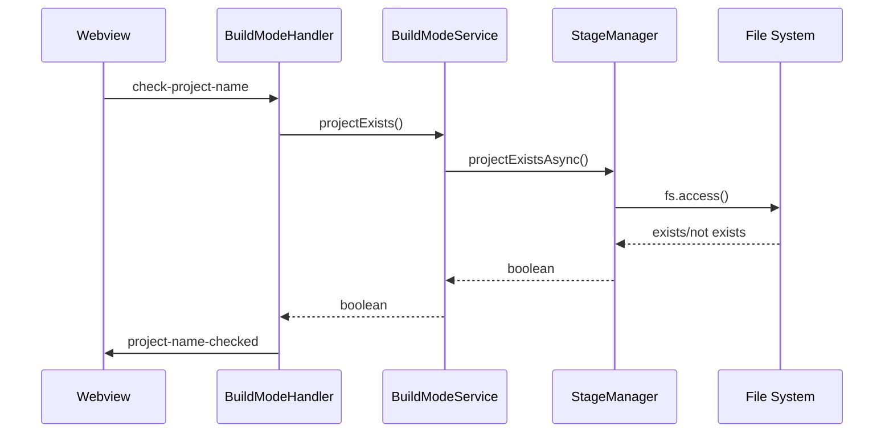

# Design Document: Build Mode Fixes

## Overview

This design addresses critical communication bugs in the Build Mode feature where message type mismatches between the backend handlers and webview frontend prevent proper project name validation, state restoration, and data persistence. The fix involves aligning message types and restructuring the file storage to use a more organized folder hierarchy.

## Architecture

The Build Mode feature follows a message-passing architecture between:

1. **Webview (Frontend)**: React-based UI in `src/webview/App.tsx` that sends messages via `vscode.postMessage()` and listens for responses via `window.addEventListener('message', ...)`

2. **BuildModeHandler (Backend)**: TypeScript handler in `src/features/build-mode/handlers/BuildModeHandler.ts` that processes webview messages and sends responses via `webview.postMessage()`

3. **BuildModeService**: Business logic layer that coordinates with StageManager, BuildLogManager, and ContentStreamer

4. **StageManager**: File system operations for reading/writing stage files and build state



## Components and Interfaces

### Message Type Alignment

The following message types need to be aligned in `src/webview/App.tsx`:

| Request Type | Handler Response | Webview Listener (Current) | Webview Listener (Fixed) |
|-------------|------------------|---------------------------|-------------------------|
| `check-project-name` | `project-name-checked` | `project-name-check` | `project-name-checked` |
| `get-build-state` | `build-state` | `build-state-loaded` | `build-state` |
| `load-build-log` | `build-log` | `build-log-loaded` | `build-log` |

### Stage Naming Convention

The stages follow a consistent naming convention defined in `STAGE_ORDER`:
- `idea` - Project idea and title
- `users` - User personas and demographics
- `features` - Feature definitions
- `team` - Team member roles
- `stories` - User stories
- `design` - Design specifications
- `building` - Active development iteration

### File Structure Changes

Current structure:
```
.personaut/
  {project-name}/
    build-state.json
    {project-name}.json (idea stage - inconsistent naming)
    {stage}.stage.json (other stages)
```

New structure:
```
.personaut/
  {project-name}/
    build-state.json
    planning/
      idea.json
      users.json
      features.json
      team.json
      stories.json
      design.json
    iterations/
      {iteration-number}/
        feedback.json
        consolidated-feedback.md
        {page-name}.png
```

### Migration Strategy

For backward compatibility:
1. When reading stage files, check both old and new locations
2. When writing stage files, always use new location
3. Update `build-state.json` paths to reflect new locations

### StageManager Interface Changes

```typescript
class StageManager {
  // Updated path methods - now uses planning/ subdirectory
  getStageFilePath(projectName: string, stage: string): string {
    // Returns: .personaut/{projectName}/planning/{stage}.json
    return path.join(this.baseDir, projectName, 'planning', `${stage}.json`);
  }
  
  getPlanningDir(projectName: string): string {
    return path.join(this.baseDir, projectName, 'planning');
  }
  
  getIterationDir(projectName: string, iterationNumber: number): string {
    return path.join(this.baseDir, projectName, 'iterations', String(iterationNumber));
  }
  
  getFeedbackPath(projectName: string, iterationNumber: number): string {
    return path.join(this.getIterationDir(projectName, iterationNumber), 'feedback.json');
  }
  
  getConsolidatedFeedbackPath(projectName: string, iterationNumber: number): string {
    return path.join(this.getIterationDir(projectName, iterationNumber), 'consolidated-feedback.md');
  }
  
  getScreenshotPath(projectName: string, iterationNumber: number, pageName: string): string {
    // Sanitize pageName to be filesystem-safe
    const safeName = pageName.toLowerCase().replace(/[^a-z0-9-_]/g, '-');
    return path.join(this.getIterationDir(projectName, iterationNumber), `${safeName}.png`);
  }
  
  // Updated initialization - creates planning/ directory
  async initializeProject(projectName: string, projectTitle?: string): Promise<void>;
  
  // Existing methods (unchanged signatures)
  writeStageFile(projectName: string, stage: string, data: any, completed: boolean): Promise<WriteResult>;
  readStageFile(projectName: string, stage: string): Promise<StageFile | null>;
  
  // New iteration methods
  async saveIterationFeedback(projectName: string, iterationNumber: number, feedback: UserFeedback[]): Promise<void>;
  async saveConsolidatedFeedback(projectName: string, iterationNumber: number, content: string): Promise<void>;
  async saveScreenshot(projectName: string, iterationNumber: number, pageName: string, data: Buffer): Promise<void>;
  async loadIterationData(projectName: string, iterationNumber: number): Promise<IterationData | null>;
}
```

### Webview Message Handler Changes

In `src/webview/App.tsx`, the message handler needs to be updated:

```typescript
// BEFORE (incorrect)
} else if (message.type === 'project-name-check') {
  // Handle project name validation response

// AFTER (correct - matches handler response)
} else if (message.type === 'project-name-checked') {
  // Handle project name validation response

// BEFORE (incorrect)
} else if (message.type === 'build-state-loaded') {
  // Handle build state loaded message

// AFTER (correct - matches handler response)
} else if (message.type === 'build-state') {
  // Handle build state message

// BEFORE (incorrect)
} else if (message.type === 'build-log-loaded') {
  // Handle build log loaded message

// AFTER (correct - matches handler response)
} else if (message.type === 'build-log') {
  // Handle build log message
```

## Data Models

### BuildState (unchanged)
```typescript
interface BuildState {
  projectName: string;
  projectTitle?: string;
  createdAt: number;
  lastUpdated: number;
  stages: {
    [key: string]: {
      completed: boolean;
      path: string;
      updatedAt: number;
      error?: string;
    };
  };
}
```

### IterationData (new)
```typescript
interface IterationData {
  iterationNumber: number;
  feedback: UserFeedback[];
  consolidatedFeedback?: string;
  screenshots: { pageName: string; path: string }[];
  createdAt: number;
  lastUpdated: number;
}

interface UserFeedback {
  personaName: string;
  rating: number;
  feedback: string;
  timestamp: number;
}
```

## Correctness Properties

*A property is a characteristic or behavior that should hold true across all valid executions of a system-essentially, a formal statement about what the system should do. Properties serve as the bridge between human-readable specifications and machine-verifiable correctness guarantees.*

### Property 1: Message Type Consistency
*For any* handler method that sends a response to the webview, the message type sent by the handler SHALL match the message type the webview listens for.
**Validates: Requirements 1.1, 1.2, 2.1, 2.2, 3.1, 3.2**

### Property 2: Project Name Validation State Update
*For any* project-name-checked message received by the webview, if the message contains `exists: true`, then `projectTitleError` SHALL be set to indicate the name is taken; otherwise `projectTitleError` SHALL be null and `sanitizedProjectName` SHALL be set to the sanitized name.
**Validates: Requirements 1.3, 1.4**

### Property 3: Build State Restoration - Project Title
*For any* build-state message with a non-null buildState, the webview SHALL set `projectTitle` to `buildState.projectTitle` or fall back to `buildState.projectName`.
**Validates: Requirements 2.3**

### Property 4: Build State Restoration - Completed Stages
*For any* build-state message with a non-null buildState containing stages, the webview SHALL set `completedSteps` to reflect the completion status of each stage from `buildState.stages`.
**Validates: Requirements 2.4**

### Property 5: Current Step Derivation
*For any* set of completed stages, the derived current step SHALL be the first stage in the stage order that is not marked as complete, or the last stage if all are complete.
**Validates: Requirements 2.5**

### Property 6: Build Log Entry Conversion
*For any* persisted build log entry, the conversion to UI log format SHALL produce a LogEntry with: timestamp as formatted time string, message as the entry content, and type mapped from entry.type (assistant→ai, error→error, otherwise→info).
**Validates: Requirements 3.3**

### Property 7: Stage File Path Generation
*For any* valid project name and stage name, the generated file path SHALL follow the pattern `.personaut/{project-name}/planning/{stage-name}.json`.
**Validates: Requirements 4.3**

### Property 8: Iteration Directory Path Generation
*For any* valid project name and iteration number, the generated iteration directory path SHALL follow the pattern `.personaut/{project-name}/iterations/{iteration-number}/`.
**Validates: Requirements 5.1, 5.2, 5.3, 5.4, 5.5**

### Property 9: Session State Preservation
*For any* call to `vscode.setState()`, the state object SHALL include `projectName`, `projectTitle`, and `buildData` fields with their current values.
**Validates: Requirements 6.1, 6.5**

### Property 10: Migration Backup Integrity
*For any* project migration, if migration fails at any step, the system SHALL restore all files from backup and the project SHALL remain in its original working state.
**Validates: Requirements 7.2, 7.3**

### Property 11: Migration Path Update
*For any* successfully migrated project, the build-state.json paths SHALL reference the new planning/ subdirectory locations.
**Validates: Requirements 7.4**

## Migration Strategy

### Detecting Old Structure
Check for existence of `{projectName}.json` or `{stage}.stage.json` files directly in project root (not in planning/).

### Migration Process
```typescript
async migrateProjectStructure(projectName: string): Promise<MigrationResult> {
  // 1. Create backup directory
  const backupDir = path.join(this.baseDir, projectName, '.backup-' + Date.now());
  
  // 2. Copy existing files to backup
  // 3. Create planning/ directory
  // 4. Move stage files to planning/ with new naming
  // 5. Update build-state.json paths
  // 6. If successful, optionally remove backup
  // 7. If failed, restore from backup
}
```

### Rollback Strategy
- Before any migration, create timestamped backup in `.backup-{timestamp}/`
- If migration fails at any step, restore all files from backup
- Log detailed error for debugging
- Return to original state so user can continue working

## Error Handling

1. **Invalid Project Name**: If project name validation fails (empty, invalid characters, too long), display error message and prevent proceeding.

2. **File System Errors**: If file operations fail, log error and attempt alternate location (temp directory) as fallback.

3. **Message Type Mismatch**: Log warning for unhandled message types to aid debugging.

4. **Session Restoration Failure**: If state cannot be restored from disk, initialize with default values and log warning.

5. **Migration Failure**: If migration fails, restore from backup, log error, and continue with old file structure until next attempt.

## Testing Strategy

### Dual Testing Approach

This implementation uses both unit tests and property-based tests:

- **Unit tests**: Verify specific examples, edge cases, and integration points
- **Property-based tests**: Verify universal properties hold across all valid inputs

### Property-Based Testing Library

We will use **fast-check** for property-based testing in TypeScript/JavaScript. Each property test will run a minimum of 100 iterations.

### Test Annotations

Each property-based test MUST be tagged with a comment in the format:
`**Feature: build-mode-fixes, Property {number}: {property_text}**`

### Unit Test Coverage

1. Message handler registration for each message type
2. File path generation for various project names and stages
3. State restoration from build-state messages
4. Error handling for invalid inputs

### Property Test Coverage

1. **Property 1**: Generate random handler method names and verify response types match expected
2. **Property 2**: Generate random project-name-checked messages and verify state updates
3. **Property 3-4**: Generate random build-state messages and verify restoration
4. **Property 5**: Generate random sets of completed stages and verify step derivation
5. **Property 6**: Generate random persisted log entries and verify conversion
6. **Property 7-8**: Generate random project names, stages, and iteration numbers and verify paths
7. **Property 9**: Generate random state updates and verify required fields are preserved
